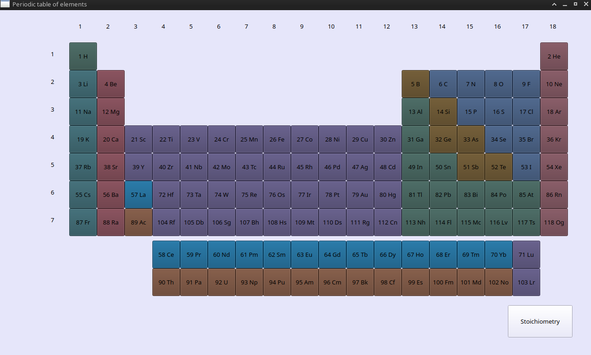
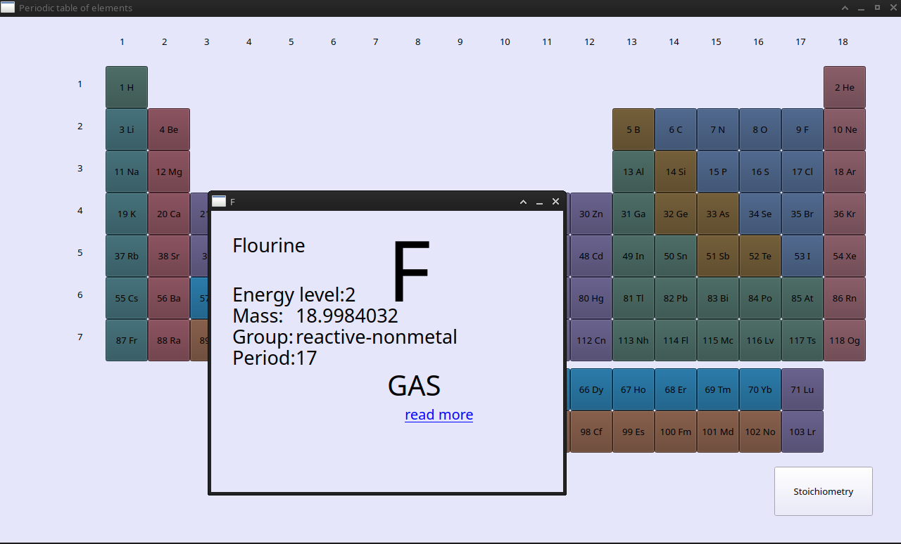
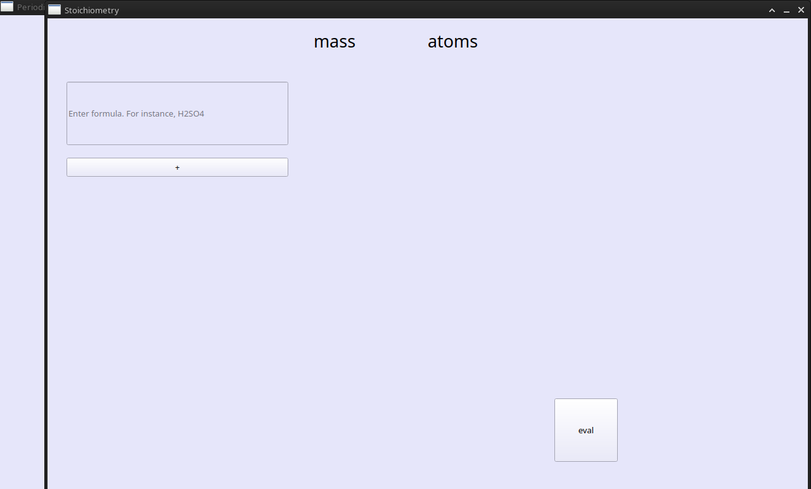

= IVPT

Interactive &amp; visual periodic table written on PyQT5.

== BASIC

This GUI application may help you with studying chemistry
(especially with calculations)

== USAGE HOWTO

1. Imagine you're doing some chemistry homework, you need to know the mass of
Flourine - you can just start the program, click on the element and you're
done!

2. You suddenly need a mass of some acid?
No problem - click on the `Stoichiometry` button, enter any formula and press
`eval`

